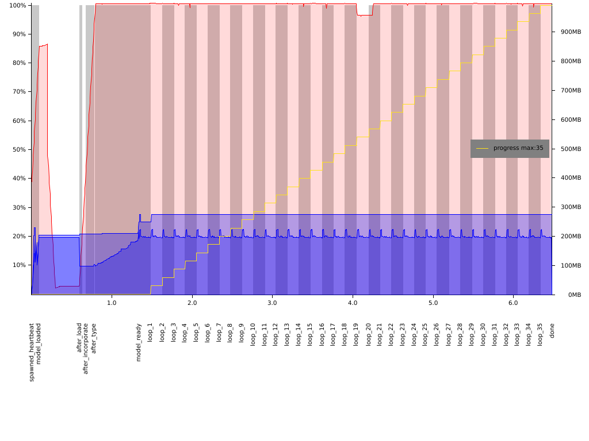

Readings is meant to get vital information for the health of a process.


[](https://docs.rs/readings-probe)

It is made of two crates:
* readings-probe is the instrumentation bit that you must depend on and setup
* readings contains the executable that will make charts from the instrumentation output

I am trying to make it easy to get the kind of graphs I used in my blog post series
a few years ago: http://www.poumeyrol.fr/2016/02/08/Hashes-to-hashes/ . Readings
is not there yet, but the will is there.

# Status

This is alpha, early work bazaar style. For instance, the probing code only
compiles on Linux, Mac and Windows. And windows has only CPU intrumentation
from the OS (help wanted from a Win32 guru for faults and mem usage :) ).

# Quickstart

## Instrument

In `Cargo.toml`:

```toml
[dependencies]
readings-probe = "0.1"
```

In your main, or just around:

```rust
// this is optional but the cost may be worth it. YMMV
readings_probe::instrumented_allocator!();

fn main() -> readings_probe::ReadingsResult<()> {
    // setup the probe
    let mut probe =
        readings_probe::Probe::new(std::fs::File::create("readings.out").unwrap()).unwrap();

    // We will use an AtomicI64 to communicate a user-defined metrics ("progress") to the probe.
    let progress = probe.register_i64("progress".to_string())?;

    // Starts the probe (1sec i a lot. heartbeat can be realistically set as low as a few millis).
    probe.spawn_heartbeat(std::time::Duration::from_millis(1000))?;

    // do some stuff, update progress
    progress.store(percent_done, std::sync::atomic::Ordering::Relaxed);

    // do more stuff, log an event
    probe.log_event("about to get crazy")?;

    // still more stuff, and another event
    probe.log_event("done")?;
    Ok(())
}
```

## Graph

* Install the command line tool. 

`cargo install readings`

* run it

`readings readings.out`

## Example



This is a incredibly beatiful example with [tract](https://github.com/snipsco/tract) loading a big
neural network modern and evaluating on a loop.

We know it does not exactly look beautiful... But this is 0.1! We will get
better. In the meantime here are a few hints:
* red curve (and area) represent the CPU usage. Here 100% represent one single core
  saturation (as we the ran the grapher with `--single-core`).
* both blue lines and are represent memory usage. The lower one is rust global
  allocator instrumentation, the higher one is the RSS as reported by the OS.
  You can notice how the global allocator probe is much more usefull than the
  RSS one...
* the yellow staircase is a user-defined metrics: in tract we defined one to
  count the loops over our neural network evaluation
* the background grey strips represent events: each time `log_event` is called,
  it switches between grey and white. The evant label is written in the lower
  part.
* memory graphes are obviously indexed by the right hand axis. All the rest is
  a percentage: %cpu, or % of the maximum value reached for user defined
  probeds.

# License

## Apache 2.0/MIT

All original work licensed under either of
 * Apache License, Version 2.0 ([LICENSE-APACHE](LICENSE-APACHE) or http://www.apache.org/licenses/LICENSE-2.0)
 * MIT license ([LICENSE-MIT](LICENSE-MIT) or http://opensource.org/licenses/MIT)
at your option.

## Contribution

Unless you explicitly state otherwise, any contribution intentionally submitted
for inclusion in the work by you, as defined in the Apache-2.0 license, shall
be dual licensed as above, without any additional terms or conditions.
